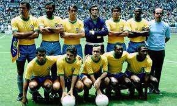

##**Historia del fútbol mundial**

###**Los equipos más exitosos de la historia**
A lo largo de la historia del fútbol han existido equipos legendarios, desde el milan de sacchi hasta el barca de guardiola han existido equipos que bien han resaltado por sus estrellas a nivel individual como por su complejidad a nivel equipo y la manera en la que destrozaban tácticamente a sus oponentes dentro de la cancha.

####5. **Brasil de 1970**
Mejor conocida como la brasil del *jogo bonito* de pelé, riverlino, jairzinho, leyendas del fútbol; es el romanticismo del fútbol en un equipo, pelé al que no le quedaba mucho pero seguía a un gran nivel, a rivelino que era un espectáculo y pues qué mas decir de este equipo si fué el que ganó el mundial de ese año.

####4. **Ajax 1971-73**
Mejor conocido como el ajax de johan cruyff, este equipo ganó tres copas de europa, lo dirigió stefan kovacs, fué un equipo que cambió el fútbol porque no se centraba únicamente en la habilidad pura de los jugadores individualmente sino que creó por así decirlo el fútbol líquido, en el que los jugadores brillaban en su conjunto, una cosa que nunca se había visto en el fútbol hasta entonces.

####3. **Milan de Sacchi 1987-91**
Este equipo de la misma manera que el Ajax innovó en el fútbol con una presión que ejercía en sus rivales, incluso goleó al real madrid en una semifinal de champions 5 a 0 y contaba con leyendas como Ban Basten, Frank Rijkaard y el Gullit, uno de los equipos más grandes de la historia.

####2. **Real Madrid 1955-60**
El Real Madrid de Alfredo di Stefano, el primer equipo que ganó la champions y lo que más tarde construyó la leyenda de club que tenemos hoy, cabe aclarar que el equipo que le pudo haber hecho competencia en esa época el Torino italiano sufrió una terrible tragedia en la que toda la plantilla falleció en un accidente aéreo pero esto no quita que este equipo fué capaz de ganar 5 champions consecutivas.

####1. **Fc Barcelona 2008-12**
El Barca de Guardiola, en parte gracias a la increíble calidad de los canteranos del equipo en esa época y contando que tenía a el mejor jugador de la historia Lionel Messi así como uno de los mejores entrenadores, Guardiola, tenía un estilo de juego que era muy complicado de contrarrestar, con una posesión brutal y una presión que destrozaba uno tras otro a todos los grandes de europa, este equipo fué el primero en ganar el sextete, y quedará para la historia del fútbol como el equipo más impresionante a nivel dominio sobre el rival en la cancha que muchas generaciones han visto.

###*Otros rankings*
####https://futbolmoderno.eu/futbol-ayer/mejores-equipos-historia/
####https://www.goal.com/es/galer%C3%ADas/barcelona-manchester-united-milan-y-los-mejores-equipos-de/6/16suzxkwk6mhm17i9rj1adsl66
####https://futbolretro.es/los-mejores-equipos-de-la-historia-del-futbol/
